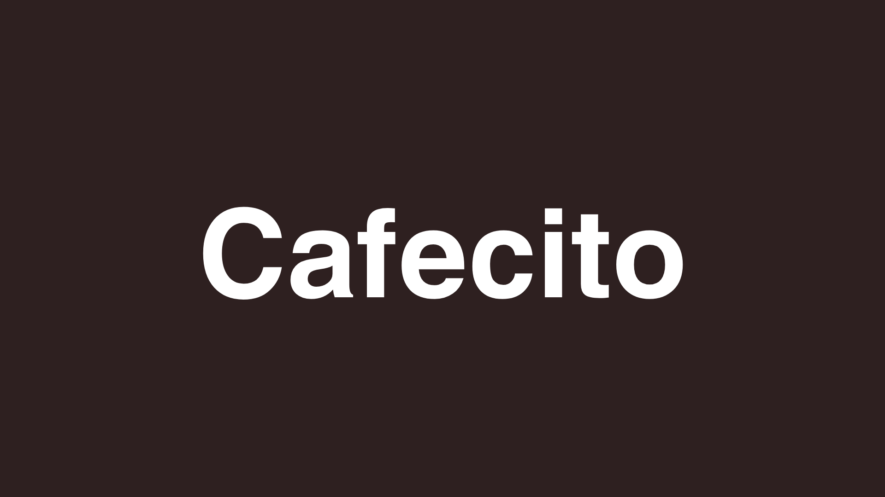
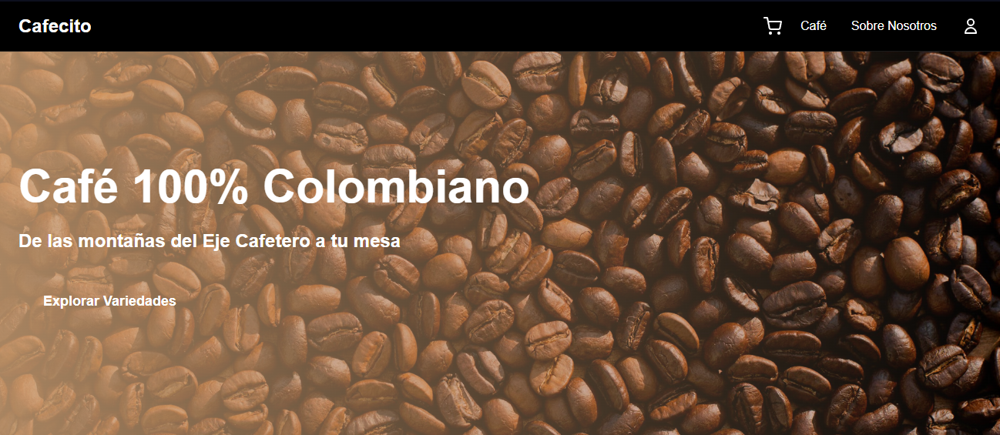
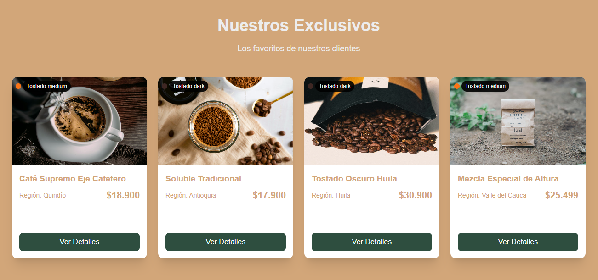
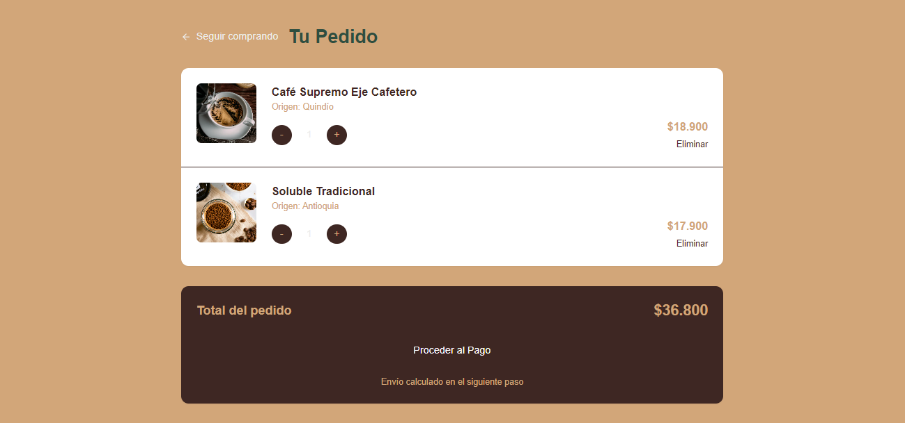
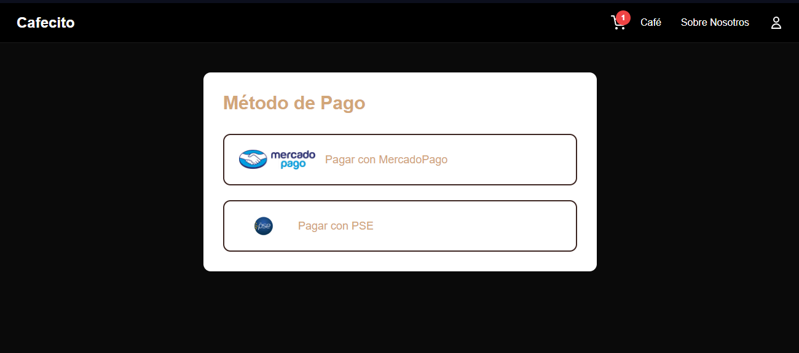
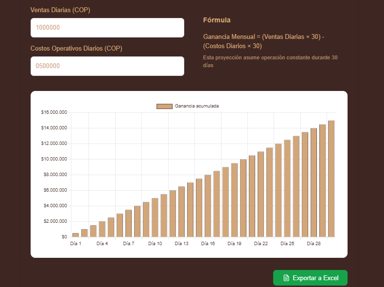

# Cafecito ☕ | Digital Store Builder



## 🌍 Contexto | Context
**Problema identificado | Identified Problem**  
En Latinoamérica, más del 60% de los pequeños comercios carecen de presencia digital efectiva. Los tenderos y productores locales necesitan una solución simple, rápida y económica para mostrar/sus productos y aceptar pagos digitales.

**Solución | Solution**  
Constructor de tiendas digitales ultra-rápido para microPYMEs, con:
- Plantillas locales (arepas, café, artesanías)
- Simulador financiero integrado
- Modo offline-first
- Integración con pasarelas de pago locales

## 📸 Capturas | Screenshots
| Sección Hero | Productos | Carrito |
|--------------|-----------|---------|
|  |  |  |

| Checkout | Dashboard |
|----------|-----------|
|  |  |

## 🚀 Configuración | Setup
```bash
# 1. Clonar repositorio
git clone https://github.com/tu-usuario/cafecito.git


# 2. Instalar dependencias
npm install

# 3. Variables de entorno (crear .env.local)
NEXT_PUBLIC_MERCADOPAGO_KEY=tu_clave
NEXT_PUBLIC_DASHBOARD_PASSWORD=clave_segura

# 4. Iniciar servidor
npm run dev

# Cafecito ☕ | Digital Store Builder


```

## 🌍 Context
**Identified Problem**  
In Latin America, over 60% of small businesses lack effective digital presence. Local shopkeepers and producers need a simple, fast, and affordable solution to showcase their products and accept digital payments.

**Solution**  
Ultra-fast digital store builder for micro-SMEs featuring:
- Localized templates (arepas, coffee, crafts)
- Integrated financial simulator
- Offline-first mode
- Local payment gateway integration

## 🚀 Quick Start
```bash
# 1. Clone repo
git clone https://github.com/your-user/cafecito.git

# 2. Install dependencies
npm install

# 3. Environment variables (create .env.local)
NEXT_PUBLIC_MERCADOPAGO_KEY=your_key
NEXT_PUBLIC_DASHBOARD_PASSWORD=secure_password

# 4. Start dev server
npm run dev